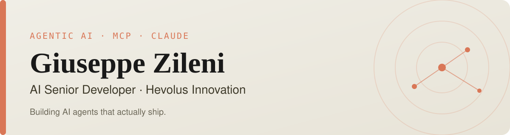

<div align="center">



<br/>


**Progetto, costruisco e porto in produzione sistemi ad agenti** — orchestrazione multi-agente, RAG, tool-use e pipeline LLM su cloud.

[](https://linkedin.com/in/gzileni)
[](https://twitter.com/@gzileni_dev)
[](https://instagram.com/gzileni)
[](https://github.com/gzileni)

</div>

---

## 🧠 Chi sono

```python
class GiuseppeZileni:
    def __init__(self):
        self.role       = "AI Senior Developer @ Hevolus Innovation"
        self.focus      = ["Agentic AI", "Multi-Agent Orchestration", "RAG", "Tool-Use / MCP"]
        self.languages  = ["Python", "TypeScript", "C#", "JavaScript", "Java"]
        self.ai_stack   = ["LangGraph", "LangChain", "Anthropic Claude",
                           "Azure AI Foundry", "OpenAI", "Model Context Protocol"]
        self.cloud      = ["Microsoft Azure", "AWS", "Google Cloud"]
        self.arch       = ["microservices", "event-driven", "agent workflows"]

    def current_mission(self):
        return "Trasformare gli LLM in agenti autonomi, affidabili e production-ready 🚀"
```

---

## 🟠 Claude Developer Toolkit

Le aree su cui lavoro ogni giorno con Claude in produzione:

| Area | Cosa faccio | Strumenti |
|------|-------------|-----------|
| 🏗️ **Agentic architecture** | Loop agentici, orchestrazione multi-agente, gestione di stato e fallback | `Claude Agent SDK` · `LangGraph` · `Microsoft Agent Framework` |
| 🔧 **Tool design & MCP** | Progetto server MCP e tool con schemi chiari, permessi e gestione errori | `Model Context Protocol` · `FastAPI` · `TypeScript` |
| 💻 **Claude Code** | Workflow di sviluppo assistito: CLAUDE.md, skill, subagent, hook | `Claude Code` · `Skills` · `Hooks` |
| ✍️ **Prompt & context engineering** | System prompt, output strutturato, prompt caching, controllo del contesto | `Messages API` · `Prompt Caching` · `Structured Output` |
| 📚 **RAG & knowledge** | Graph-RAG, retrieval ibrido, grounding e citazioni | `Neo4j` · `Qdrant` · `PostgreSQL/pgvector` |
| ✅ **Evals & affidabilità** | Test degli agenti, valutazione delle risposte, guardrail | `LLM-as-judge` · `Test suite` · `Observability` |

<sub>Logo e marchi Anthropic, Claude e Claude Code appartengono ai rispettivi proprietari. Questo profilo non è affiliato né approvato da Anthropic.</sub>

---

## 🤖 AI & Agentic Stack


## 💻 Languages & Frameworks


## ☁️ Cloud, Data & DevOps


---

## 🏗️ In evidenza — Agent Engineering Studio

> **[Agent Engineering Studio](https://github.com/agent-engineering-studio)** — il laboratorio dove trasformo idee in **prototipi di AI agents** pronti da testare: starter kit, template, demo end-to-end e best practice per passare dal concept alla prima release.

| Progetto | Stack | Descrizione |
|----------|-------|-------------|
| **[opendata-ai](https://github.com/agent-engineering-studio/opendata-ai)** | `Anthropic` · `MCP` · `FastAPI` · `Next.js` | AI conversazionale su open-data italiani ed europei (CKAN, ISTAT, Eurostat, OECD) |
| **[knowledge-graph](https://github.com/agent-engineering-studio/knowledge-graph)** | `Graph-RAG` · `Neo4j` · `MCP` · `MAF` | Knowledge Graph production-ready — companion del libro *"AI che Ragiona"* |
| **[mcp-geo-server](https://github.com/agent-engineering-studio/mcp-geo-server)** | `MCP` · `MAF` · `GeoServer` · `Claude` | Agente LLM che pilota GeoServer in linguaggio naturale (WMS/WFS, PostGIS) |
| **[limen](https://github.com/agent-engineering-studio/limen)** | `Multi-Agent` · `PostGIS` · `Python` | Monitoraggio multi-fattore del rischio frane sul territorio italiano |

<div align="center">

**➡️ Esplora tutti i progetti su [github.com/agent-engineering-studio](https://github.com/agent-engineering-studio)**

</div>

---

## 📊 GitHub Stats

<div align="center">


</div>

### 📈 Attività dei commit

<div align="center">


</div>

---

<div align="center">

### ✍️ Random Dev Quote


*"Building AI agents that actually ship."*

</div>
