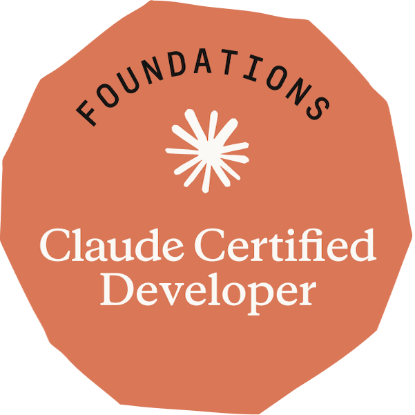
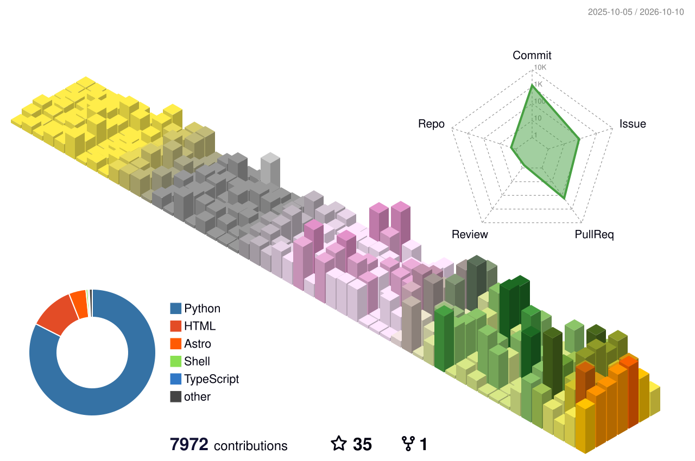
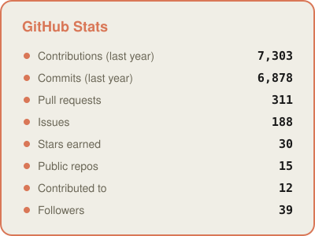
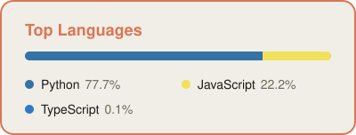
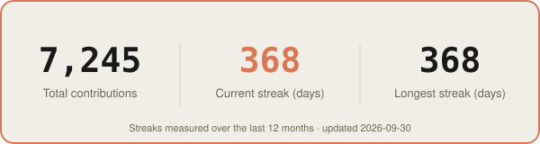
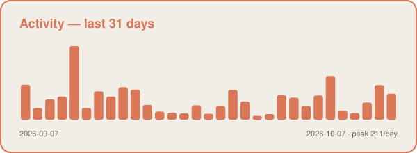

<div align="center">


<br/>


**I design, build and ship agentic systems to production** — multi-agent orchestration, RAG, tool use and LLM pipelines on the cloud.

[](https://linkedin.com/in/gzileni)
[](https://twitter.com/@gzileni_dev)
[](https://instagram.com/gzileni)
[](https://github.com/gzileni)

</div>

---

## 🧠 About me

```python
class GiuseppeZileni:
    def __init__(self):
        self.role       = "AI Senior Developer @ Hevolus Innovation"
        self.focus      = ["Agentic AI", "Multi-Agent Orchestration", "RAG", "Tool-Use / MCP"]
        self.languages  = ["Python", "TypeScript", "C#", "JavaScript", "Java"]
        self.ai_stack   = ["LangGraph", "LangChain", "Anthropic Claude",
                           "Azure AI Foundry", "OpenAI", "Model Context Protocol"]
        self.cloud      = ["Microsoft Azure", "AWS", "Google Cloud"]
        self.arch       = ["microservices", "event-driven", "agent workflows"]

    def current_mission(self):
        return "Turning LLMs into autonomous, reliable, production-ready agents 🚀"
```

---

## 🟠 Claude Developer Toolkit

<table>
<tr>
<td align="center" width="200">

</td>
<td>

**Claude Certified Developer — Foundations**<br/>
Anthropic certification in building applications with Claude.

</td>
</tr>
</table>

The areas I work on every day with Claude in production:

| Area | What I do | Tools |
|------|-------------|-----------|
| 🏗️ **Agentic architecture** | Agentic loops, multi-agent orchestration, state management and fallbacks | `Claude Agent SDK` · `LangGraph` · `Microsoft Agent Framework` |
| 🔧 **Tool design & MCP** | MCP servers and tools with clear schemas, permissions and error handling | `Model Context Protocol` · `FastAPI` · `TypeScript` |
| 💻 **Claude Code** | AI-assisted development workflows: CLAUDE.md, skills, subagents, hooks | `Claude Code` · `Skills` · `Hooks` |
| ✍️ **Prompt & context engineering** | System prompts, structured output, prompt caching, context control | `Messages API` · `Prompt Caching` · `Structured Output` |
| 📚 **RAG & knowledge** | Graph-RAG, hybrid retrieval, grounding and citations | `Neo4j` · `Qdrant` · `PostgreSQL/pgvector` |
| ✅ **Evals & reliability** | Agent testing, response evaluation, guardrails | `LLM-as-judge` · `Test suite` · `Observability` |

<sub>Anthropic, Claude and Claude Code logos and trademarks belong to their respective owners. This profile is not affiliated with or endorsed by Anthropic.</sub>

---

## 🤖 AI & Agentic Stack


## 💻 Languages & Frameworks


## ☁️ Cloud, Data & DevOps


---

## 🏗️ Featured — Agent Engineering Studio

> **[Agent Engineering Studio](https://github.com/agent-engineering-studio)** — the lab where I turn ideas into **AI agent prototypes** ready to test: starter kits, templates, end-to-end demos and best practices to go from concept to first release.

| Project | Stack | Description |
|----------|-------|-------------|
| **[opendata-ai](https://github.com/agent-engineering-studio/opendata-ai)** | `Anthropic` · `MCP` · `FastAPI` · `Next.js` | Conversational AI over Italian and European open data (CKAN, ISTAT, Eurostat, OECD) |
| **[knowledge-graph](https://github.com/agent-engineering-studio/knowledge-graph)** | `Graph-RAG` · `Neo4j` · `MCP` · `MAF` | Production-ready Knowledge Graph — companion to the book *"AI che Ragiona"* |
| **[mcp-geo-server](https://github.com/agent-engineering-studio/mcp-geo-server)** | `MCP` · `MAF` · `GeoServer` · `Claude` | LLM agent that drives GeoServer in natural language (WMS/WFS, PostGIS) |
| **[limen](https://github.com/agent-engineering-studio/limen)** | `Multi-Agent` · `PostGIS` · `Python` | Multi-factor landslide risk monitoring across Italy |

<div align="center">

**➡️ Explore all projects at [github.com/agent-engineering-studio](https://github.com/agent-engineering-studio)**

</div>

---

## 📊 GitHub Stats

<div align="center">



<br/>




<br/>



<br/>



</div>

---

<div align="center">

### ✍️ Random Dev Quote


*"Building AI agents that actually ship."*

</div>
