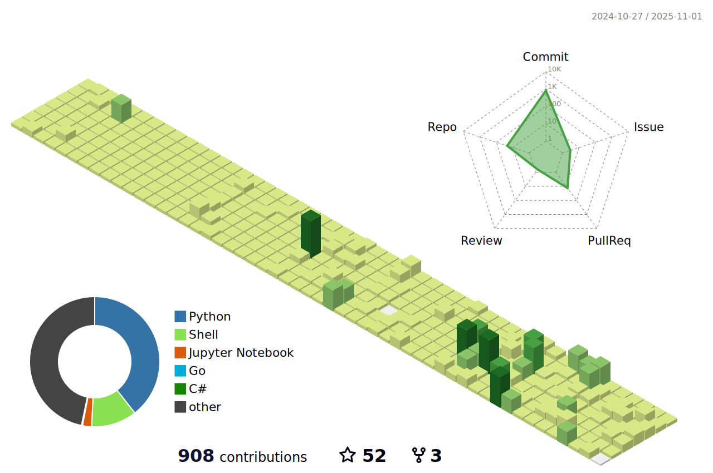

<h2> Hi, I'm Giuseppe Zileni! </h2>

<p><em>AI Seniore Developer at <a target="_blank" href="[Quest-IT](https://www.quest-it.com/)">Quest-IT</a></br></p>

[](https://instagram.com/gzileni) [](https://linkedin.com/in/gzileni) [](https://twitter.com/@gzileni_dev) 
[](https://github.com/gzileni)


###  What about me...  

```javascript
const gzileni = {
  code: [Javascript, Typescript, Python, C#, Java],
  tools: [React, Redux, Node, Angular, Fastify, Jest, Docker, Flask, .NET],
  architecture: ["microservices", "event-driven", "design system pattern"],
  cloud: [Google Cloud, AWS, Microsoft Azure],
  ai: [LangGraph, LangChain]
}
```

### 💻 Tech Stack:
                                       

## 🏆 GitHub Trophies


# 📊 GitHub Stats:


### ✍️ Random Dev Quote


---
[](https://visitcount.itsvg.in)
